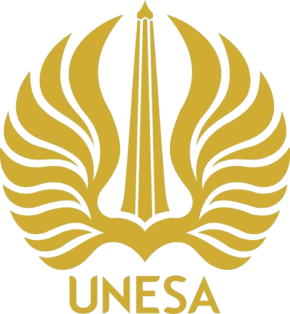
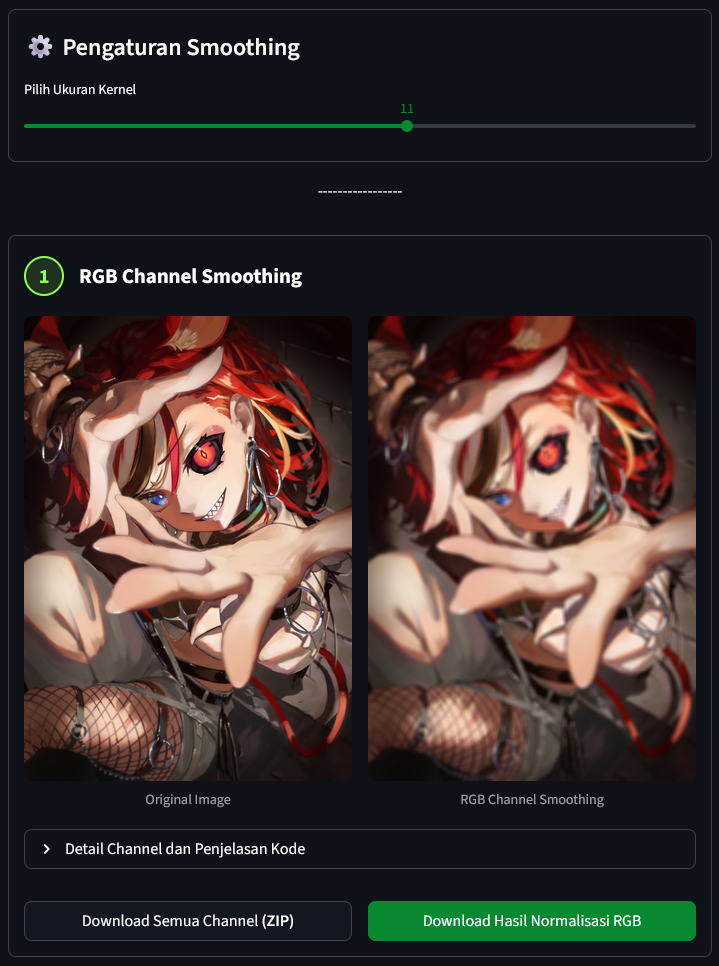
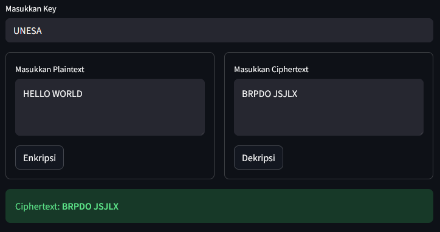

<div align="center">



<h1>🎓 Learning Dashboard Semester 4</h1>

<p>
<strong>Aplikasi Interaktif berbasis Web untuk Portofolio Mata Kuliah Pengolahan Citra Digital & Keamanan Data</strong>
</p>

<!-- Badges -->

<p>


</p>
</div>

<br />

## 📖 Tentang Proyek

Proyek ini adalah sebuah dashboard interaktif yang dibangun menggunakan Streamlit. Aplikasi ini berfungsi sebagai portofolio pembelajaran untuk semester 4 Program Studi Teknik Informatika, Universitas Negeri Surabaya (UNESA).

Di dalam dashboard ini, terdapat implementasi langsung dari teori-teori matematis dan komputasional, meliputi konversi ruang warna, filtering citra (smoothing & sharpening), hingga kriptografi klasik (Vigenere Cipher).

## ✨ Fitur Utama

1. 🖼️ Pengolahan Citra Digital (Digital Image Processing)\*\*

   Modul ini berisi demonstrasi pemrosesan citra digital secara _real-time_ yang dioptimasi dengan `OpenCV` dan `numpy`.
   - **Konversi Ruang Warna:** Mengubah citra RGB ke format CMY, CMYK, HSI, YUV, dan YCbCr lengkap dengan pemecahan visual per-_channel_.
   - **Image Smoothing:** Penghalusan gambar menggunakan metode _RGB Channel Smoothing_ dan _Intensity Slicing_ (HSI).
   - **Image Sharpening:** Penajaman gambar menggunakan filter konvolusi Laplacian pada _RGB_ dan _Intensity Channel_.
   - **Fitur Ekspor:** Tersedia fitur unduhan hasil gambar atau keseluruhan _channel_ dalam bentuk file `.zip`.

<div align="center">

<p><em>Demo Konversi Ruang Warna dan Filtering Citra</em></p>
</div>

2. **🔐 Keamanan Data (Kriptografi)**

   Modul ini mendemonstrasikan implementasi keamanan data dasar menggunakan teknik substitusi teks.
   - **Vigenere Cipher Engine:** Alat enkripsi dan dekripsi interaktif berbasis Vigenere.
   - **Visualisasi Proses:** Menampilkan tabel visual yang menjelaskan bagaimana algoritma memproses _plaintext_ ke _ciphertext_ (dan sebaliknya) secara karakter maupun representasi numerik.
   - **Materi Edukasi:** Rangkuman interaktif tentang teknik dasar kriptografi (Caesar, ROT13, Substitusi, dll).

<div align="center">

<p><em>Demo Enkripsi & Dekripsi Vigenere Cipher</em></p>
</div>

## 🛠️ Teknologi yang Digunakan

- **Python 3.x** - Bahasa Pemrograman Utama
- **Streamlit** - Framework Web UI interaktif
- **OpenCV (`cv2`)** - Pemrosesan gambar (_Computer Vision_)
- **NumPy** - Komputasi matriks dan array berkinerja tinggi
- **Pandas** - Visualisasi data ke dalam bentuk tabel

## 🚀 Cara Menjalankan Aplikasi (Local Development)

Proyek ini dilengkapi dengan `Makefile` untuk mempermudah eksekusi. Pastikan Anda sudah menginstal [Python](https://www.python.org/downloads/).

**Langkah 1:** Clone repositori ini

```powershell
git clone [https://github.com/maling1326/streamlitsemester4.git](https://github.com/maling1326/streamlitsemester4.git)
cd streamlitsemester4
```

**Langkah 2:** Install dependencies
Jika Anda menggunakan Windows dan memiliki `make`, Anda bisa langsung menjalankan:

```powershell
make install
```

(Alternatif manual: `pip install -r requirements.txt`)

**Langkah 3:** Jalankan Aplikasi Streamlit

```
make run
```

(Alternatif manual: `streamlit run Home_Page.py`)\
💡 Aplikasi akan otomatis terbuka di browser Anda pada alamat http://localhost:8501.

## 📂 Struktur Direktori

```
📦 streamlitsemester4
┣ 📂 .streamlit             # Konfigurasi tema UI Streamlit
┣ 📂 assets                 # Penyimpanan gambar/logo statis
┣ 📂 pages                  # Halaman Multi-page Streamlit
┃ ┣ 📜 1\*🖼️_Pengolahan_Citra_Digital.py
┃ ┗ 📜 2\*🔐_Keamanan_Data.py
┣ 📂 utils                  # Modul utilitas & logika bisnis
┃ ┗ 📜 image_processing.py  # Algoritma pemrosesan citra yang di-cache
┣ 📜 Home_Page.py           # Entry point aplikasi (Main Page)
┣ 📜 Makefile               # Script otomatisasi terminal
┗ 📜 requirements.txt       # Daftar pustaka Python
```

## 👤 Pengembang

**Maliq Rafaldo**

- **NIM:** 24051204132
- **Kelas:** TI 2024 D
- **Institusi:** Universitas Negeri Surabaya (UNESA)

<p align="center">
<i>Dibuat sebagai titik kumpul semua materi dan tugas mata kuliah semester 4 </i>
</p>
